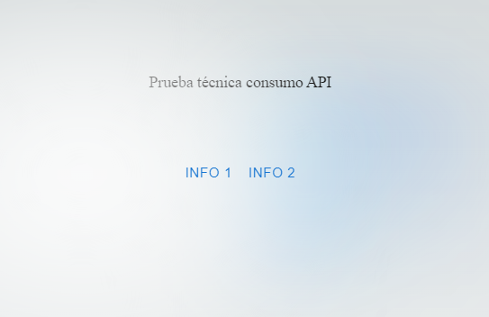
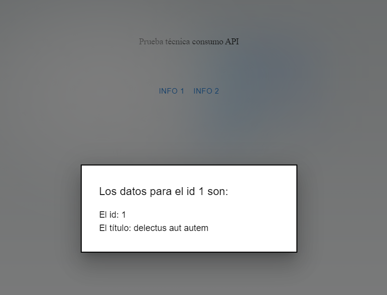

Tarea principal

Consume una API y muestra los datos en un modal.

API URL: https://jsonplaceholder.typicode.com/

En este ejercicio se pretende reincidir en el aprendizaje de consumo API con **fetch**.
Uso de libreria Material UI (Mui): https://mui.com/material-ui/react-modal/

Tareas secundarias

Crea un input que permita escribir al usuario y al pulsar un botón pasa todo a mayúsculas el cambio se hace sobre el contenido del input.

Crea un input que permita escribir al usuario y cuenta las vocales sacando el resultado en la pantalla a medida que escribe

